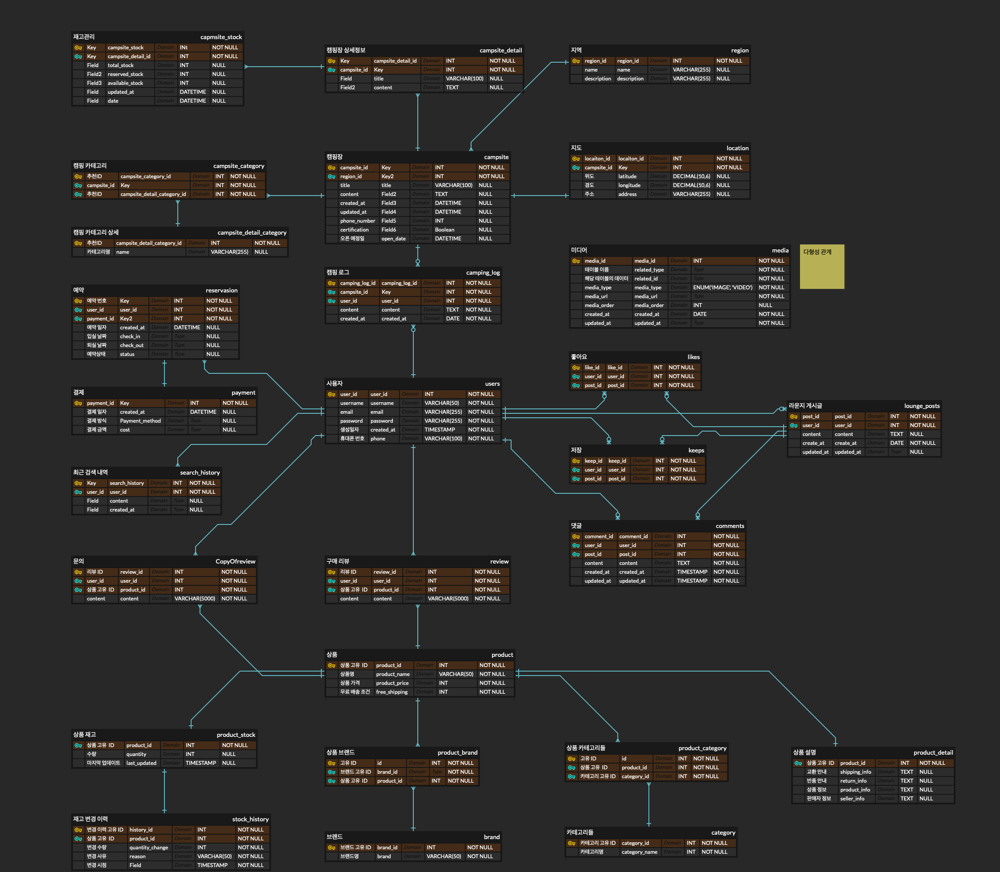

# Campit DB Modeling Project 


링크 -  https://camfit.co.kr

## 프로젝트 개요

이 프로젝트는 `camfit.co.kr` 웹사이트의 핵심 데이터베이스 스키마와 SQL 로직을 구현하는 토이 프로젝트입니다. 실제 서비스의 복잡성을 모두 반영하기보다는, 주요 엔티티(예: 사용자, 캠핑장, 예약, 리뷰 등)와 그 관계를 중심으로 데이터베이스를 설계하고, 기본적인 CRUD(Create, Read, Update, Delete) 작업을 위한 SQL 쿼리를 작성하는 데 중점을 둡니다.

## 목표
- `camfit.co.kr`과 유사한 서비스의 데이터 모델링 능력 향상.
- 관계형 데이터베이스 설계 원칙 적용 연습.
- 효율적인 SQL 쿼리 작성 및 최적화 경험.
- 실제 서비스 시나리오에 기반한 데이터베이스 활용 능력 강화.

## 기술 스택

- **데이터베이스:** MySQL (또는 기타 관계형 데이터베이스)
- **언어:** SQL

## ERD


## 프로젝트 구조

- `schema.sql`: 테이블 생성, 관계 정의 등 데이터베이스 스키마를 포함하는 파일.
- `data.sql`: 테스트를 위한 샘플 데이터를 삽입하는 SQL 파일.
- `queries.sql`: 주요 기능(예: 캠핑장 검색, 예약, 리뷰 작성 등)에 필요한 SQL 쿼리 예시.
- `dump.sql`: 데이터베이스 전체를 **백업 또는 복원**하기 위한 **완전한 스냅샷 파일**.
- `images/`: DB ERD 및 홈페이지 img.

## 시작하기

1.  **데이터베이스 설정:** MySQL 서버를 설치하고, 프로젝트를 위한 데이터베이스를 생성합니다.
    ```sql
    CREATE DATABASE campit_db;
    USE campit_db;
    ```
2.  **스키마 및 데이터 로드:** `/dump.sql` 파일을 실행하여 테이블을 생성하고 샘플 데이터를 삽입합니다.
    ```bash
    mysql -u [username] -p campit < dump.sql
    ```
3.  **쿼리 실행:** `queries.sql` 파일의 쿼리들을 실행하며 데이터베이스 기능을 테스트합니다.

## 팀원

- 김새하
- 이미정
- 이민구
